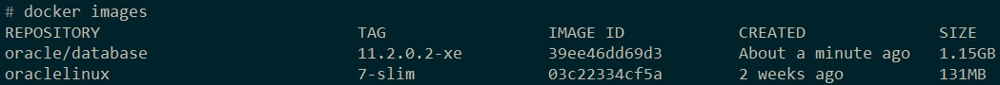
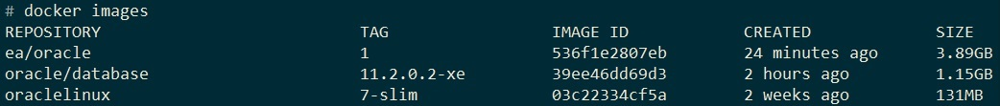
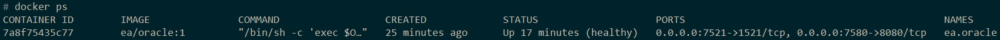

# docker-oracle

How to Create a Docker Image with Oracle 11.2.0.2-xe.

## Download source and scripts

### Docker scripts files
A full HOW TO create an image in your macchine is explained here [Oracle Database on Docker](https://github.com/oracle/docker-images/blob/master/OracleDatabase/SingleInstance)
and [here](https://github.com/oracle/docker-images/tree/master/OracleDatabase/SingleInstance).
In this project you have all you need to create ```Oracle 11.2.0.2-xe```. 

### Oracle rpm file
Nevertheless you will need Oracle source files, which are not present in the links above. 
Oracle files are present in the file ```oracle-xe-11.2.0-1.0.x86_64.rpm.zip``` which you can download [here](http://download.xskernel.org/soft/linux-rpm/).

### Final structure
Your file system should look like this, before running the command.
```
/image-to-build
	/11.2.0.2
		checkDBStatus.sh
		Checksum.xe
		Dockerfile.xe
		oracle-xe-11.2.0-1.0.x86_64.rpm
		runOracle.sh
		setPassword.sh
		xe.rsp
	buildDockerImage.sh
```	

## Create Oracle Database Docker image

To create the image ```	oracle/database:11.2.0.2-xe``` in your ```Local Registry```, run the following command. If you are using Windows, use ```Git Bash``` for interpreting ```.sh``` files.
 
>buildDockerImage.sh -v 11.2.0.2 -x

After the build you will see the following two images in your Local Registry.



## Create your own Oracle image extending the standard one

Build the image and run the container using the ```docker-compose``` file.
>docker-compose up -d

Now you should see the new image.


Check if the container is running.
>docker ps

Wait until the running container goes in ```healthy``` STATUS.


Connect to the running container.
>docker container exec -it ea.oracle bash

Check logs outside the running container. 
>docker logs -f ea.oracle

Check logs inside the running container.
>bash-4.2# tail -100f $ORACLE_BASE/diag/rdbms/*/*/trace/alert*.log

Test the DB connection from outside.
>sqlplus sys/admin@localhost:7521/XE as sysdba

Test the DB connection inside the container.
>bash-4.2# sqlplus sys/admin@localhost:1521/XE as sysdba

Test the DB connection for the application user. The following are the data for connecting to the DB using a client like ```sqldeveloper```.
>sqlplus my_user/my_password@localhost:7521/XE

### Start/Stop Oracle instance
>bash-4.2# /etc/init.d/oracle-xe start

>bash-4.2# /etc/init.d/oracle-xe stop


### Windows files error when running on Linux
Sometime when changing ```.sh``` files in Windows may happen that you see the error ```Error: bad interpreter: No such file or directory``` when running these files in Linux container. 
In this case make sure the files do not have wrong characters. 
>Find ```\r\n``` replace with ```\n``` in the incriminated ```.sh``` files.

Or from ```Git Bash```
>dos2Unix fileName.sh